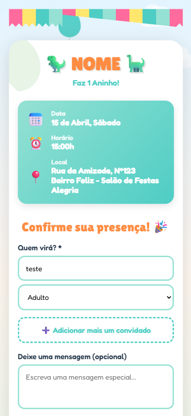

# 🦖 Sistema de Confirmação de Presença - Aniversário Infantil

Sistema simples e divertido para confirmação de presença (RSVP) em festas de aniversário infantil, com tema de dinossauros! 🎉


## ✨ Funcionalidades

- ✅ **Formulário de confirmação** com múltiplos convidados
- 👨‍👩‍👧‍👦 **Sistema de família** - adicione quantos convidados quiser
- 👶 **Categorização** - adultos e crianças separados
- 🎨 **Design responsivo** e animado
- 🦖 **Tema divertido** com dinossauros, balões e nuvens flutuantes
- 💾 **Integração com Google Sheets** (opcional)
- 📱 **Mobile-first** - funciona perfeitamente em celular

## 📸 Screenshots

### Desktop


### Mobile


## 🚀 Como Usar

### Opção 1: Uso Simples (Sem Backend)

1. **Clone o repositório:**
```bash
git clone https://github.com/marcola20/rsvp-aniversario.git
cd rsvp-aniversario
```

2. **Personalize as informações:**
   - Abra o `index.html`
   - Edite o nome da criança
   - Altere a data, hora e local do evento
   - Ajuste a data limite de confirmação

3. **Abra o arquivo:**
   - Simplesmente abra `index.html` no navegador
   - Ou use um servidor local:
```bash
# Com Python
python -m http.server 8000

# Com Node.js (http-server)
npx http-server
```

### Opção 2: Com Google Sheets (Recomendado)

Para salvar as confirmações automaticamente em uma planilha do Google Sheets:

1. **Crie uma planilha no Google Sheets**

2. **Configure o Google Apps Script:**
   - Na planilha, vá em **Extensões** → **Apps Script**
   - Cole o código do arquivo `google-apps-script.js` 
   - Execute a função `configurarPlanilha`
   - Implante como **Aplicativo da Web**

3. **Configure o JavaScript:**
   - Abra `js/script.js`
   - Substitua `'SUA_URL_DO_GOOGLE_APPS_SCRIPT_AQUI'` pela URL do seu script

4. **Faça o deploy:**
   - Netlify, Vercel ou GitHub Pages

## 📁 Estrutura do Projeto

```
rsvp-aniversario/
│
├── index.html                   # Página principal
├── style.css                    # Estilos (tema dinossauro, animações)
└── js/
    └── script.js                # Lógica do formulário
    └── google-apps-script.js    # Configurar o Google Apps Script
├── README.md                    # Este arquivo
└── LICENSE                      # Licença MIT
```

## 🎨 Personalização

### Cores

As cores principais estão definidas em CSS variables no arquivo `css/style.css`:

```css
:root {
    --dino-orange: #FF8C42;
    --dino-blue: #4ECDC4;
    --dino-green: #95E1D3;
    --dino-yellow: #FFE66D;
    --dino-pink: #FF6B9D;
}
```

### Fontes

O projeto usa fontes do Google Fonts:
- **Lilita One** - Para títulos
- **Fredoka** - Para o corpo do texto

### Animações

O projeto inclui várias animações CSS:
- 🌤️ Nuvens flutuantes
- 🎈 Balões subindo
- 🦖 Dinossauros balançando
- ✨ Transições suaves

## 🛠️ Tecnologias Utilizadas

- **HTML5** - Estrutura semântica
- **CSS3** - Animações e design responsivo
- **JavaScript (Vanilla)** - Lógica do formulário
- **Google Fonts** - Tipografia
- **Google Apps Script** - Backend opcional

## 📦 Deploy

### Netlify (Recomendado)

1. Crie uma conta em [netlify.com](https://netlify.com)
2. Arraste e solte a pasta do projeto
3. Pronto! Seu site está no ar

### Vercel

```bash
npm i -g vercel
vercel
```

### GitHub Pages

1. Faça push do código para o GitHub
2. Vá em **Settings** → **Pages**
3. Selecione a branch `main`
4. Acesse `https://seu-usuario.github.io/rsvp-aniversario`

## 📊 Estrutura dos Dados

Os dados são enviados no seguinte formato JSON:

```json
{
  "guests": [
    {"name": "João Silva", "ageCategory": "adulto"},
    {"name": "Maria Silva", "ageCategory": "adulto"},
    {"name": "Pedro Silva", "ageCategory": "crianca"}
  ],
  "totalGuests": 3,
  "adults": 2,
  "children": 1,
  "message": "Mal podemos esperar pela festa!",
  "timestamp": "2025-01-20T15:30:00.000Z"
}
```

## 🤝 Contribuindo

Contribuições são bem-vindas! Sinta-se à vontade para:

1. Fazer um Fork do projeto
2. Criar uma branch (`git checkout -b feature/NovaFuncionalidade`)
3. Commit suas mudanças (`git commit -m 'Adiciona nova funcionalidade'`)
4. Push para a branch (`git push origin feature/NovaFuncionalidade`)
5. Abrir um Pull Request

## 📝 Ideias para Melhorias

- [ ] Adicionar mais temas (princesas, super-heróis, etc)
- [ ] Sistema de notificações por email/SMS
- [ ] QR Code para compartilhar
- [ ] Galeria de fotos da festa
- [ ] Contador regressivo para o evento
- [ ] Lista de presentes sugeridos
- [ ] Mapa interativo do local

## 📄 Licença

Este projeto está sob a licença MIT. Veja o arquivo [LICENSE](LICENSE) para mais detalhes.

## 👤 Autor

**Marcos Vinicius Alves de Souza**
- GitHub: [@marcola20](https://github.com/Marcola20)
- LinkedIn: [Marcos Vinicius](https://www.linkedin.com/in/marcosviniciussa/)

---

⭐ Se este projeto te ajudou, considere dar uma estrela no repositório!

🦖 Feito com 💚 para festas inesquecíveis!
